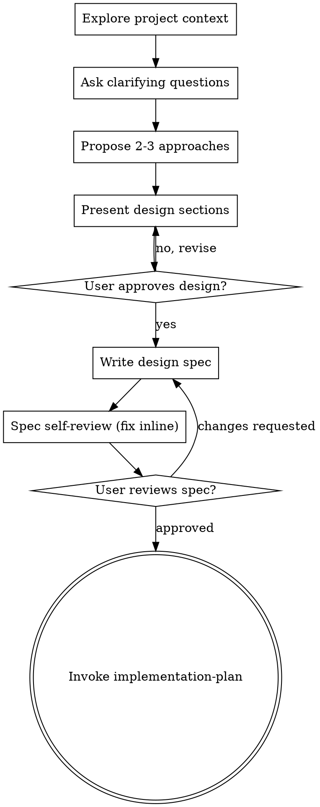

<!-- Adapted from obra/superpowers `brainstorming` (MIT, (c) 2025 Jesse Vincent),
     decoupled from superpowers-only sub-skills and the browser companion, with
     spec-artifact discipline influenced by github/spec-kit (MIT). See ../../NOTICE. -->

# Design Spec (brainstorm ideas into an approved design)

Turn an idea into a fully formed design and spec through natural collaborative dialogue. Understand the project context first, then ask questions one at a time to refine the idea. Once you understand what you are building, present the design and get approval before any implementation.

<HARD-GATE>
Do NOT write code, scaffold a project, or take any implementation action until you have presented a design and the user has approved it. This applies to every project regardless of perceived simplicity.
</HARD-GATE>

## Anti-pattern: "this is too simple to need a design"

Every project goes through this. A todo list, a one-function utility, a config change. Simple projects are exactly where unexamined assumptions cause the most wasted work. The design can be short, a few sentences for a truly simple project, but you MUST present it and get approval.

## Checklist

Create a task for each item and complete them in order:

1. **Explore project context**: check files, docs, recent commits.
2. **Ask clarifying questions**: one at a time, to understand purpose, constraints, and success criteria.
3. **Propose 2-3 approaches**: with trade-offs and your recommendation.
4. **Present the design**: in sections scaled to their complexity, getting approval after each section.
5. **Write the design spec**: save to `docs/specs/YYYY-MM-DD-<topic>-design.md` and commit.
6. **Spec self-review**: inline check for placeholders, contradictions, ambiguity, and scope.
7. **User reviews the written spec**: ask the user to review the file before proceeding.
8. **Transition to planning**: invoke the `implementation-plan` skill.

## Process flow

The terminal state is invoking `implementation-plan`. Do not jump to any other implementation step from here.

## The process

**Understanding the idea**
- Check the current project state first (files, docs, recent commits).
- Before detailed questions, assess scope. If the request describes multiple independent subsystems (for example "a platform with chat, file storage, billing, and analytics"), flag it immediately and decompose before refining details.
- If the project is too large for one spec, help the user split it into sub-projects: the independent pieces, how they relate, and what order to build them. Each sub-project gets its own spec, plan, and implementation cycle.
- For appropriately-scoped work, ask one question per message. Prefer multiple choice when possible; open-ended is fine. Focus on purpose, constraints, and success criteria.

**Exploring approaches**
- Propose 2-3 approaches with trade-offs. Lead with your recommendation and the reason.

**Presenting the design**
- Present once you understand what you are building. Scale each section to its complexity (a few sentences if straightforward, up to 200-300 words if nuanced). Ask after each section whether it looks right.
- Cover architecture, components, data flow, error handling, and testing.

**Design for isolation and clarity**
- Break the system into units that each have one clear purpose, communicate through well-defined interfaces, and can be understood and tested independently. For each unit you should be able to say what it does, how to use it, and what it depends on.
- Smaller, well-bounded units are easier to reason about and edit. A file growing large is usually a signal it does too much.

**Working in existing codebases**
- Explore the current structure before proposing changes, and follow existing patterns. Include targeted improvements where existing problems affect the work, but do not propose unrelated refactoring.

## The design spec (owned artifact)

Write the approved design to `docs/specs/YYYY-MM-DD-<topic>-design.md` (user preferences for location override this) and commit it. A clear spec, influenced by spec-driven development, states at least:

- **Problem and goal**: what this is for, in one or two sentences.
- **User scenarios**: the concrete situations the design must serve.
- **Requirements**: what it must do, each one testable.
- **Non-goals**: what is explicitly out of scope (YAGNI made visible).
- **Approach**: architecture, components, data flow, error handling, testing, with the chosen option and why.

## Spec self-review

After writing the spec, look at it with fresh eyes:

1. **Placeholder scan**: any "TBD", "TODO", incomplete sections, or vague requirements? Fix them.
2. **Internal consistency**: do any sections contradict each other? Does the architecture match the feature descriptions?
3. **Scope check**: is this focused enough for one implementation plan, or does it need decomposition?
4. **Ambiguity check**: could any requirement be read two ways? If so, pick one and make it explicit.

Fix issues inline. No need to re-review, just fix and move on.

## User review gate

After the self-review passes, ask the user to review the written spec:

> "Spec written and committed to `<path>`. Please review it and tell me if you want changes before we write the implementation plan."

Wait for the response. If they request changes, make them and re-run the self-review. Only proceed once the user approves, then invoke `implementation-plan`.

## Key principles

- One question at a time. Do not overwhelm.
- Multiple choice preferred when it fits.
- YAGNI ruthlessly. Remove unnecessary features from every design.
- Always propose 2-3 approaches before settling.
- Present, then get approval, before moving on.
- Be flexible. Go back and clarify when something does not make sense.
